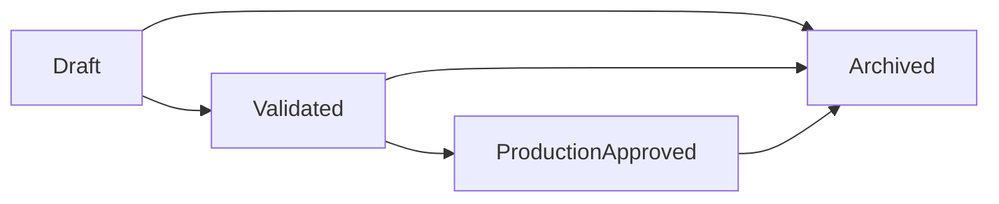

# RECON Research Skill Design

> **Status:** Design complete (docs-only). Implementation is staged in `task.md`.
> **Scope:** Platform-global internal research in RECON, shared by RADAR, THE LAB, and BLUEPRINT.

---

## 1. Purpose

The Research Skill generates structured company intelligence that can be reused across the platform:

- **RADAR:** campaign personalization and targeting context
- **THE LAB:** richer demo setup context
- **BLUEPRINT:** production workflow and prompt tuning inputs

Research is not module-owned. It is a RECON asset in a single internal scope. Workspace scoping applies only to BLUEPRINT client deployments and Client Portal views.

---

## 2. Ownership and Boundaries

- **System of record:** RECON
- **Scope boundary:** Global internal (outside workspaces)
- **Authoring:** Internal operators and automated jobs
- **Consumption:** RADAR, THE LAB, BLUEPRINT
- **Client Portal:** Read-only derived views only (not raw internal notes by default)

Guiding rule: modules reference research assets; they do not fork copies unless explicitly snapshotted for audit.

---

## 3. Data Model (Proposed)

```typescript
type ResearchStatus = 'draft' | 'validated' | 'production_approved' | 'archived';

interface ResearchRecord {
  id: string;
  target_id?: string; // prospect, account, or company profile id
  source: 'perplexity' | 'scrape' | 'manual' | 'import';
  title: string;
  summary: string;
  competitors: string[];
  market_position?: string;
  offerings: string[];
  tech_stack: string[];
  evidence: Array<{ label: string; url?: string; snippet?: string }>;
  confidence_score?: number; // 0-1
  status: ResearchStatus;
  created_by: string;
  created_at: string;
  updated_at: string;
}
```

Optional companion entities for traceability:

- `research_runs` (prompt/model/runtime metadata)
- `research_links` (maps records to campaigns, demos, blueprints)

---

## 4. Lifecycle



- **Draft:** initial AI/manual output
- **Validated:** reviewed by operator, safe for internal use
- **ProductionApproved:** allowed for BLUEPRINT production use
- **Archived:** retained for history, excluded from defaults

---

## 5. Module Contracts

### RADAR
- Reads `validated` and `production_approved` records for messaging context.
- Writes draft research from campaign discovery/signal workflows.

### THE LAB
- Reads existing research to prefill context during demo build.
- Writes draft updates when new business context is discovered during demo prep.

### BLUEPRINT
- Reads only `production_approved` records by default.
- Can reference `validated` records with explicit operator confirmation.

---

## 6. Merge Contract with Scraping and KB

Research should merge with scrape outputs and KB retrieval without overwriting provenance:

```typescript
interface ReconContextEnvelope {
  scrape: {
    companyName?: string;
    industry?: string;
    products?: string[];
    offers?: string[];
    qualifications?: string[];
  };
  research: ResearchRecord[];
  knowledgeBase: {
    kb_ids: string[];
    retrieved_chunks?: string[];
  };
}
```

Prompt assembly order:
1. Core business fields
2. Scrape context
3. Research highlights
4. KB retrieval blocks

---

## 7. Governance and RBAC Notes

- All RECON research records are internal-scope (no workspace key required).
- Internal roles are role-scoped (`super_admin`, `operator`) for read/write behavior.
- Client Viewer access is restricted to curated summaries in CLIENT PORTAL.
- Promotion to `production_approved` requires operator action and auditability.

---

## 8. Implementation Sequencing (Future)

1. Define DB schema for internal-scope research records and links.
2. Build `POST /api/research` and `GET /api/research` with status filters.
3. Integrate RADAR campaign read/write hooks.
4. Integrate THE LAB prefill and enrichment actions.
5. Gate BLUEPRINT on `production_approved` data for production deploys.
